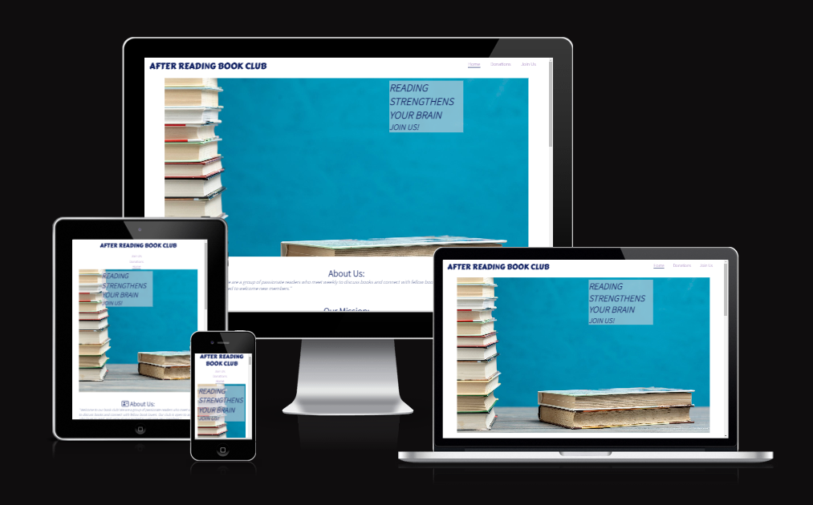

# After Reading Book Club    
After Reading Book Club is a welcoming community of passionate readers who meet weekly to discuss books and connect with fellow book lovers. Our mission is to promote a love of literature, encourage critical thinking, increase imagination and creativity, and cultivate a reading habit in a positive and nurturing environment. We meet once a week to discuss the book of the week, share our thoughts, experiences, and insights on the book, and vote on the next book we will read and discuss. We welcome anyone who loves to read, and we're committed to exploring the potential of books to inspire, challenge, and transform us together as a community. 

# Live Demo
You can find a live demo simply [here](https://zanettiprado.github.io/after-reading-book-club/)

# User Experience (UX)
## Ideal user for Book Club 
- Individuals who are enthusiastic about reading.
- People who enjoy reading but do not have enought time to do so and wish to motivate themselves to being reading.
- People that want to start a new activity or hobby.
## User stories
### First Time Visitor Goals
- As a first-time visitor, I want to easily understand the main purpose of the website and learn more about the club. 
- As a first-time visitor, I want to be able to easily navigate throughout the pages to easily find the content.
- As a first-time visitor, I want to learn about the community and see if I can be a part of the club by matching my expectations with what the website presents me.

### As A Returning Visitor
- As a returning visitor to the book club website I want to see what book they have read in the mean time
- As a returning visitor to the book club website, I want to invite friends and family to join the club, so we can share our love of reading and participate in meaningful discussions together.
- As a returning visitor to the book club website I want to see if the have updates about the next sessions and if the place has change 

### As A Frequent visitor 
- As a frequent visitor to the book club website, I want to connect with other members and discuss books online, so I can engage with the club community even when I can't attend meetings in person.
- As a frequent visitor to the book club website I want to bring new ideias and help to find more people interessed in the community 
- As a frequent visitor to the book club website I want to follow up in new donations book page to see if I can help people starting with this hobby. 

# Language used 
- HTML
- CSS

# Features
### Navigation
At the top of the page the navigation shows a clickable AFTER READING BOOK CLUB also other 3 options to navigate throughout the website:
- Home: index.html
- Donations: donations.html
- Join Us: join-us.html 

### Header 
The header was created using a hero image a pile of books and a cover test sayint "Reading strengthens your brain, Join us". The cover text contrasts with the Hero image

### About Us and Our Mission
After Reading Book Club is a welcoming community of passionate readers who meet weekly to discuss books and connect with fellow book lovers. Our mission is to promote a love of literature, encourage critical thinking, increase imagination and creativity, and cultivate a reading habit in a positive and nurturing environment. We meet once a week to discuss the book of the week, share our thoughts, experiences, and insights on the book, and vote on the next book we will read and discuss. We welcome anyone who loves to read, and we're committed to exploring the potential of books to inspire, challenge, and transform us together as a community.

### Goals and Hangouts
The club seeks to meet new people, share experiences of reading, and choose books that expose members to new ideas, genres, and writing styles. They aim to cultivate a reading habit and encourage members to read more regularly. The club meets every Saturday at 9am at the Hilton Dublin on Charlemont Pl in Saint Kevin's. During meetings, members discuss a carefully selected book of the week, share their thoughts and insights, and vote on the next book to read. The club values the power of literature to enrich lives and welcomes all to join.

### Donations 
We have some books available for people to collect during our weekly meetings. These books are for anyone who loves reading or wants to start the activity.

### Join Us
To express interest in our weekly meetings, members have to fill out a form indicating whether they want to join for reading or to meet new people with the same passion. The form requires name, last name, email address, age, and purpose for joining.

### Footer 
You find the Social Medias just clicking in the links and also credits the website. 

## Testing 
- Here I have to say that I tested my page in following brawsers: Chrome, Firefox and Safari.
- The page is responsive for different scrren sizes tested using devtools device toolbar. 
- The whole page is working and is responsive header, home, donations and joins us is working as expected. 
- form is working and do not allowed you submit if the criteria is not right. 

### Bugs 
- In the very first deployment images were not loading correctly and I needed to fix it.
It happens because...

### Validator testing 
- HTML 
- CSS 
- Accessibility pages are clear and text contrasting with background easy to read accessibility is 100%

## Deployment 
- The website was created in GitHub using GitPod tools 

## Credits 
All images in this page were taken in [freepik](https://www.freepik.com/) 
