# After Reading Book Club    
After Reading Book Club is a welcoming community of passionate readers who meet weekly to discuss books and connect with fellow book lovers. Our mission is to promote a love of literature, encourage critical thinking, increase imagination and creativity, and cultivate a reading habit in a positive and nurturing environment. We meet once a week to discuss the book of the week, share our thoughts, experiences, and insights on the book, and vote on the next book we will read and discuss. We welcome anyone who loves to read, and we're committed to exploring the potential of books to inspire, challenge, and transform us together as a community. 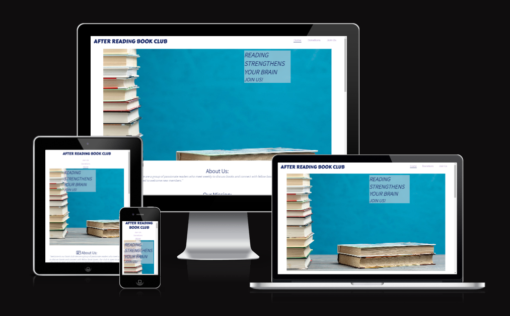

# Live Demo
You can find a live demo simply [here](https://zanettiprado.github.io/after-reading-book-club/)

# User Experience (UX)
## Ideal user for Book Club 
- Individuals who are enthusiastic about reading.
- People who enjoy reading but do not have enought time to do so and wish to motivate themselves to being reading.
- People that want to start a new activity or hobby.
## User Stories
### First Time Visitor Goals
- As a first-time visitor, I want to easily understand the main purpose of the website and learn more about the club. 
- As a first-time visitor, I want to be able to easily navigate throughout the pages to easily find the content.
- As a first-time visitor, I want to learn about the community and see if I can be a part of the club by matching my expectations with what the website presents me.

### As A Returning Visitor
- As a returning visitor to the book club website I want to see what book they have read in the mean time
- As a returning visitor to the book club website, I want to invite friends and family to join the club, so we can share our love of reading and participate in meaningful discussions together.
- As a returning visitor to the book club website I want to see if the have updates about the next sessions and if the place has change 

### As A Frequent Visitor 
- As a frequent visitor to the book club website, I want to connect with other members and discuss books online, so I can engage with the club community even when I can't attend meetings in person.
- As a frequent visitor to the book club website I want to bring new ideias and help to find more people interessed in the community 
- As a frequent visitor to the book club website I want to follow up in new donations book page to see if I can help people starting with this hobby. 

# Language used 
- HTML
- CSS
# Design 

## Features
- Responsive for all devices sizes 
#
### Navigation
At the top of the page the navigation shows a clickable AFTER READING BOOK CLUB also other 3 options to navigate throughout the website:

- Home: index.html [home](https://zanettiprado.github.io/after-reading-book-club/index.html)
- Donations: donations.html [Donations](https://zanettiprado.github.io/after-reading-book-club/index.html)
- Join Us: join-us.html [Joim us](https://zanettiprado.github.io/after-reading-book-club/index.html) 
# 

## Index 
### Header 
The header was created using a Hero Image a pile of books and a cover text saying "Reading strengthens your brain, Join us". The cover text contrasts with the Hero image and brings blue color as the main theme of the website and we will talk about it in the color scheme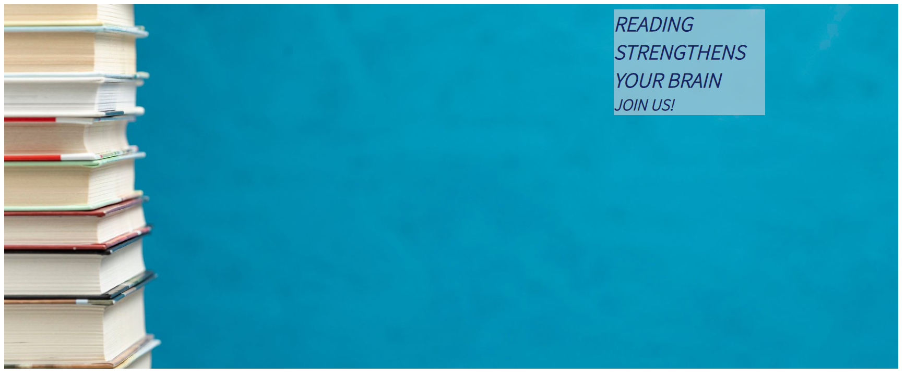

 

### About Us and Our Mission
After Reading Book Club is a welcoming community of passionate readers who meet weekly to discuss books and connect with fellow book lovers. Our mission is to promote a love of literature, encourage critical thinking, increase imagination and creativity, and cultivate a reading habit in a positive and nurturing environment. We meet once a week to discuss the book of the week, share our thoughts, experiences, and insights on the book, and vote on the next book we will read and discuss. We welcome anyone who loves to read, and we're committed to exploring the potential of books to inspire, challenge, and transform us together as a community.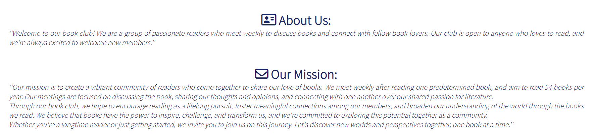

### Goals and Hangouts
The club seeks to meet new people, share experiences of reading, and choose books that expose members to new ideas, genres, and writing styles. They aim to cultivate a reading habit and encourage members to read more regularly. The club meets every Saturday at 9am at the Hilton Dublin on Charlemont Pl in Saint Kevin's. During meetings, members discuss a carefully selected book of the week, share their thoughts and insights, and vote on the next book to read. The club values the power of literature to enrich lives and welcomes all to join.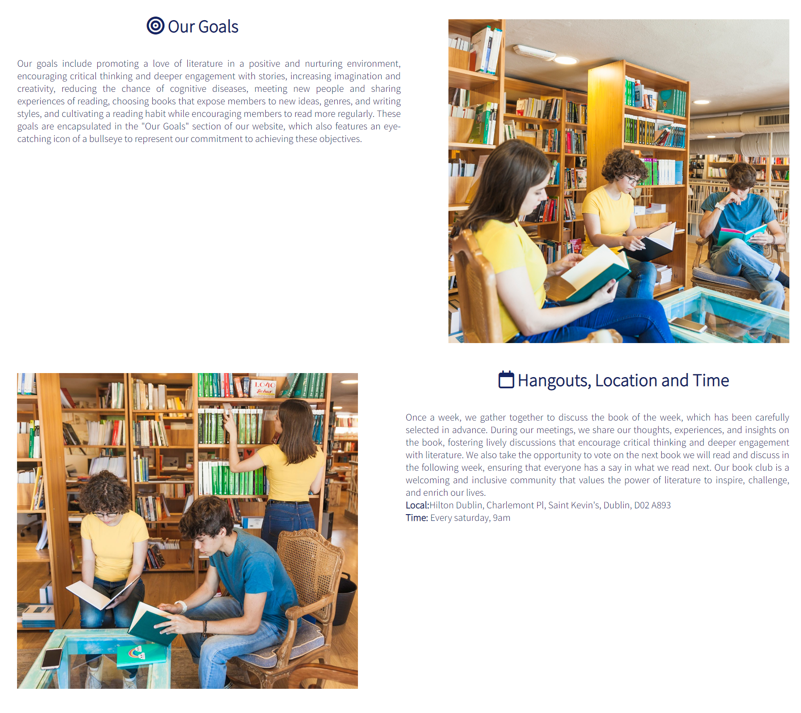

### Donations 
We have some books available for people to collect during our weekly meetings. These books are for anyone who loves reading or wants to start the activity. 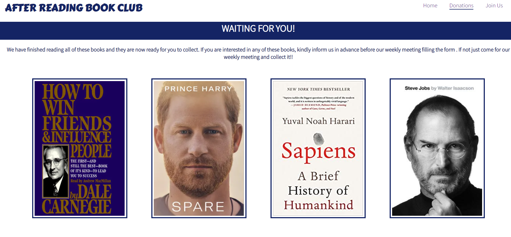

### Join Us
To express interest in our weekly meetings, members have to fill out a form indicating whether they want to join for reading or to meet new people with the same passion. The form requires name, last name, email address, age and purpose for joining.

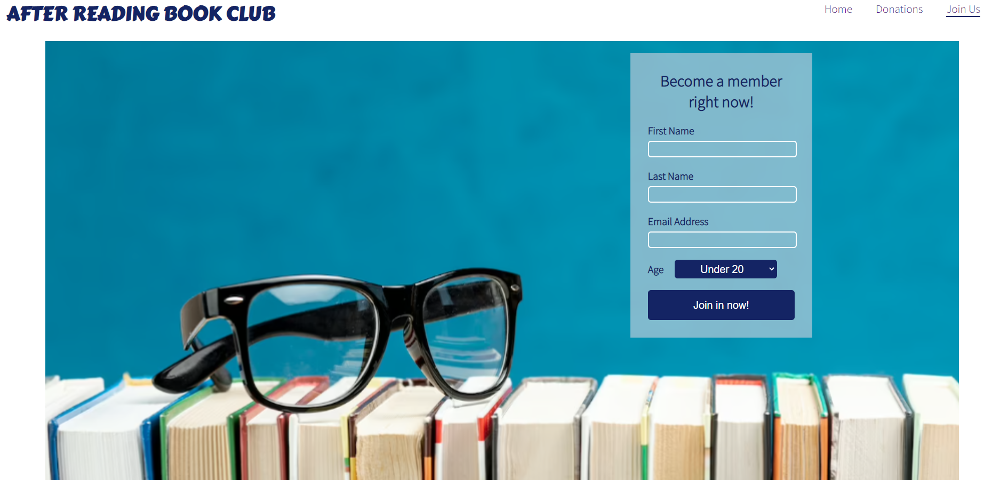

### Footer 
You find the Social Medias just clicking in the links and also credits of this website. 

# Testing 
## Accessibility
The accessibility of this webiste was tested using DevTools lighthouse and it returned 100%.
- Scheme colors contrast checked to make sure user can read all the content.
- HTML5 landmark elements are used to improve navigation.
- Custom controls have associated labels

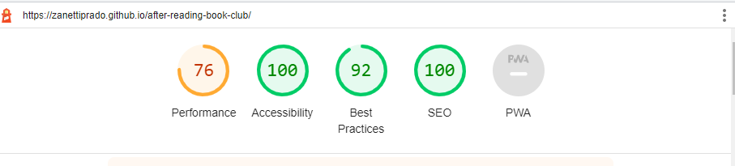

## Functionality
W3C Markup Validator and W3C CSS Validator Services were used to validate each page of the project to ensure that there were no syntax errors in the project. 
 - Markups Validation Service - [Test here](https://validator.w3.org/#validate_by_input)
 - CSS Validation Service - [Test here](https://jigsaw.w3.org/css-validator/)

 * Index 
 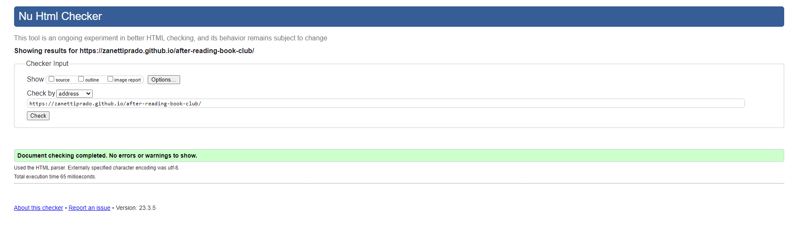 
 * Donations 
 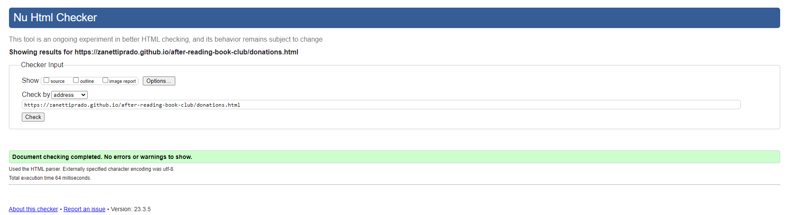
 * Join us 
 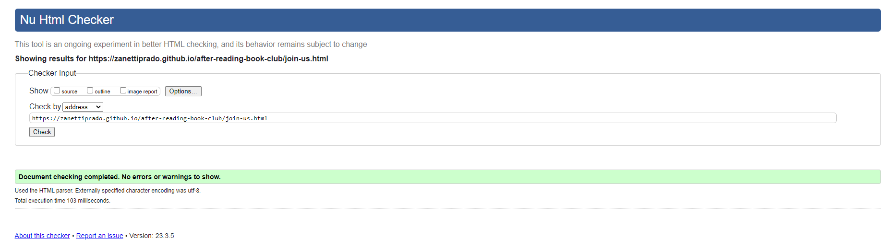
 * Css 
 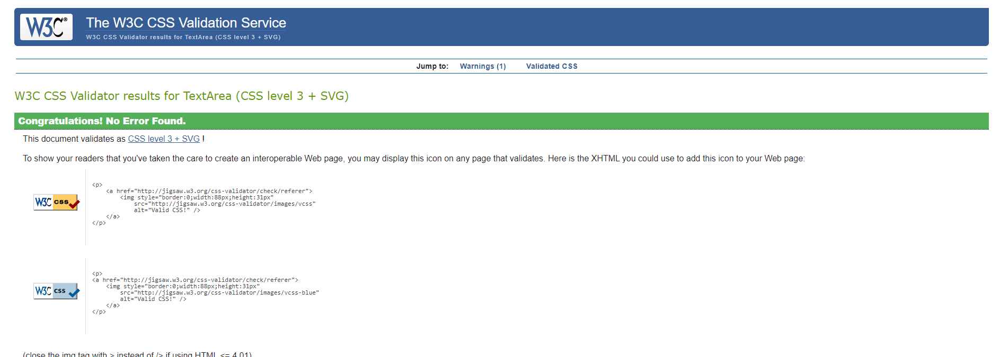

## Further testing 
* The website is resposive and was tested for the following Viewports
    * Desktop
1600x992px scaled down to scale(0.3181)
    * Laptop
1280x802px scaled down to scale(0.277)
    * Tablet
768x1024px scaled down to scale(0.219)
    * Mobile
320x480px scaled down to scale(0.219)

# Bugs 
## Known bugs 
- For some mobiles the visibility of the form can be affected but still working.  
- A white gap can be seen to the right of the background image affecting the navigation bar but can still being clicked. 

## Fixed bugs
- After first deployment images were not loading correctly and the path was changed for absolute to make it solved. 
- Unordered List items was used at the beginnig to describe goals but it was affecting user understanding and it was changed for a text using paragraph

# Compatibility 
The website displays correctly across different browsers and screen sizes. It was tested for Chrome Mozilla Firefox, Safari and Edge. 

When using Safari browser for mobile, the navigation is covered by the backgroud but it does not affect the user experience since logo still being clickable

# Color Scheme 

Blue represents calmness, serenity, and stability. It's associated with the ocean, sky, and water which can create a relaxing environment for readers. It can also help reduce eye strain and fatigue. Incorporating blue into a reading space can be as simple as using blue-hued light bulbs or adding blue-colored accents to the decor. This is the main reason when you open the website the first color you find is blue. I used also light grey to contrast with the blue and you can find a bit of orange in few borders. 

# Typography and Icons 
The fonts were extract from [Google Fonts](https://fonts.google.com/) I used Assistant and Corter one. Icons from [Fontsawesome](https://fontawesome.com/)

# Deployment 
The website was created in GitHub using GitPod tools accessing the Code Institute 

# Credits 
All images in this page were taken in [freepik](https://www.freepik.com/) 
